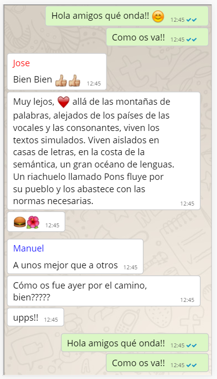

# README #

El recurso jqWhatsappFake te permite simular una conversación mantenida a través de Whatsapp.
Se puede utilizar para mostar una conversación con propósitos pedagógicos o con cualquier otro.

### ¿Cómo implementarlo? ###

Seleccionamos un elemento y la añadimos la clase **hz-whatsapp-fake**.

    

Lanzamos el recurso:

    $(".hz-whatsapp-fake").whatsappfake({
        data_json: "data/conversation.json"
    });

Como parámetro principal le pasamos la ruta de un json en el que estará la conversación que se va a mostrar.

El json tiene este formato:

    {
      "conversations": [
        {
          "conversation": {
            "type": "whatsapp",
            "hour_start": "12:00",
            "user_me": "María",
            "posts": [
              {
                "user": "María",
                "posts_user": [
                  {
                    "post_line": "Hola amigos qué onda!! <i class='em em-blush'></i>",
                    "seconds": 0
                  },
                  {
                    "post_line": "Como os va!!",
                    "seconds": 1
                  }
                ]
              },
              {
                "user": "Jose",
                "posts_user": [
                  {
                    "post_line": "Bien Bien <i class='em em---1'></i><i class='em em---1'></i>",
                    "seconds": 10
                  },
                  {
                    "post_line": "Muy lejos, <i class='em em-heart'></i>  allá de las montañas  de palabras, alejados de los países de las vocales y las consonantes, viven los textos simulados. Viven aislados en casas de letras, en la costa de la semántica, un gran océano de lenguas. Un riachuelo llamado Pons fluye por su pueblo y los abastece con las normas necesarias. ",
                    "seconds": 1
                  },{
                    "post_line": "<i class='em em-hamburger'></i><i class='em em-hibiscus'></i>",
                    "seconds": 10
                  }
                ]
              },
              {
                "user": "Manuel",
                "posts_user": [
                  {
                    "post_line": "A unos mejor que a otros",
                    "seconds": 10
                  },
                  {
                    "post_line": "Cómo os fue ayer por el camino, bien?????",
                    "seconds": 10
                  },
                  {
                    "post_line": "upps!!",
                    "seconds": 10
                  }
                ]
              }, {
                "user": "María",
                "posts_user": [
                  {
                    "post_line": "Hola amigos qué onda!!",
                    "seconds": 0
                  },
                  {
                    "post_line": "Como os va!!",
                    "seconds": 1
                  }
                ]
              }
            ]
          }
        }
      ],
      "users": [
        {
          "name": "María",
          "color": "black",
          "avatar": "img/maria.png"
        },
        {
          "name": "Jose",
          "color": "red",
          "avatar": "img/jose.png"
        },{
          "name": "Manuel",
          "color": "blue",
          "avatar": "img/jose.png"
        }
      ]
    }

Por un lado añadimos la conversación y por otro los datos de los usuarios:

    {
        "conversations": [{
            "conversation": {}
            }],
        "users": []
    }

El recurso permite que existe más de una conversación en un mismo json.

**user_me**. 
Cuando se está en una conversación de whatsapp, el usuario lo visualiza desde su smartphone
y su conversación aparece alineada a la derecha, con un fondo diferente y no aparece su nombre
en los mensajes. Este usuario será user_me.
 
**hour_start**. 
Es la hora a la que comienza el primer post. Posteriormente se van 
añadiendo segundos y el recurso calcula la hora.

    "conversation": {
            "type": "whatsapp",
            "hour_start": "12:00",
            "user_me": "María",
            "posts": []
    }

Dentro del array post, comenzamos a escribir los mensajes. 
En priner lugar indicamos el usuario que escribe **user**.
Seguidamente indicamos los post en caso de que escriba más de uno con
diferentes envíos **posts_user**.
Indicamos el mensaje a través de **post_line** y los segundos (**seconds**) de diferencia 
respecto al mensaje anterior. 

             "posts": [
               {
                 "user": "María",
                 "posts_user": [
                   {
                     "post_line": "Hola amigos qué onda!! <i class='em em-blush'></i>",
                     "seconds": 0
                   },
                   {
                     "post_line": "Como os va!!",
                     "seconds": 1
                   }
                 ]
               }
             ]

Podemos incluir emoticonos. Para ellos se utiliza la librería ubicada 
en https://afeld.github.io/emoji-css/.
La manera de incluirlo es incluir 

    <i class="em em-some-emoji"></i>
    
Recordar incluir el link:

    <link href="https://afeld.github.io/emoji-css/emoji.css" rel="stylesheet">

https://markdown.es/sintaxis-markdown/